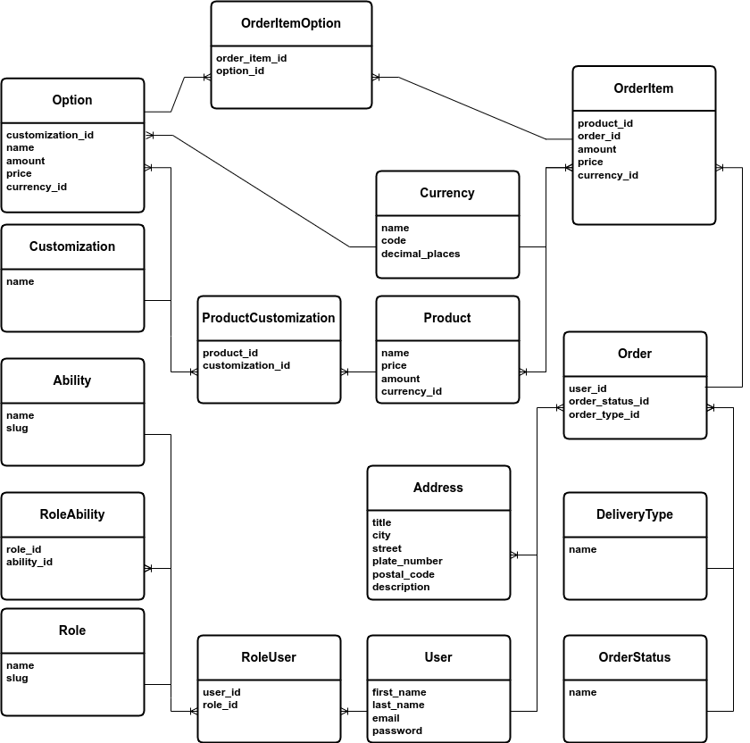

# Rock star coffee Application

This application provides an API (Application Programming Interface) and 
performs ordering process.

## Index

* [Requirements](#requirements)
* [Usage](#usage)
  * [Run the application](#run-application)
* [Tests](#tests)

## Requirements

You need `docker` and `docker-compose` in order to run this application.
If you don't have `make` on your operating system for running the application,
you need to read `Makefile` and do as `up` method says, otherwise you just need
to follow [Running](#run-application) section.

## Usage

In this section working with the application is described.

## Run Application

for running application you need to execute `up` method using `make` command
like bellow:

```shell
make up
```

## Tests

You can run tests outside of the application's container by `make` tool using
bellow command.

```shell
make test
```

# Diagram


